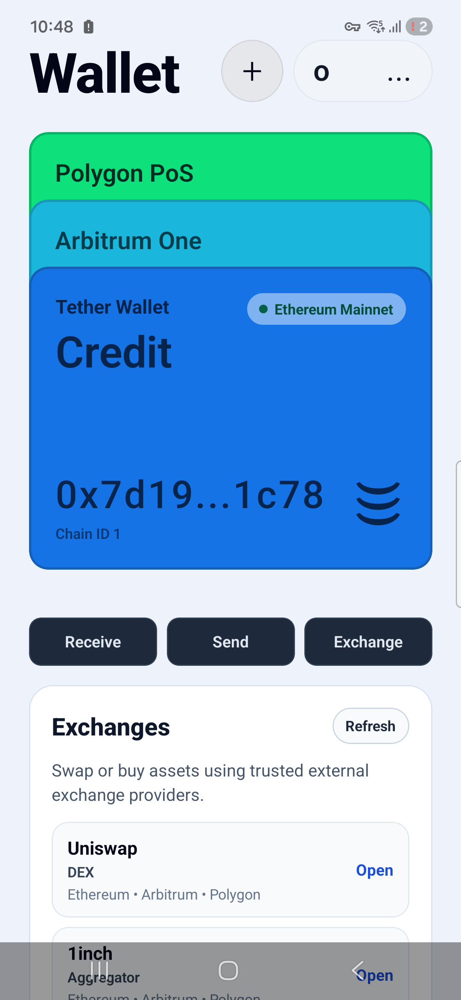
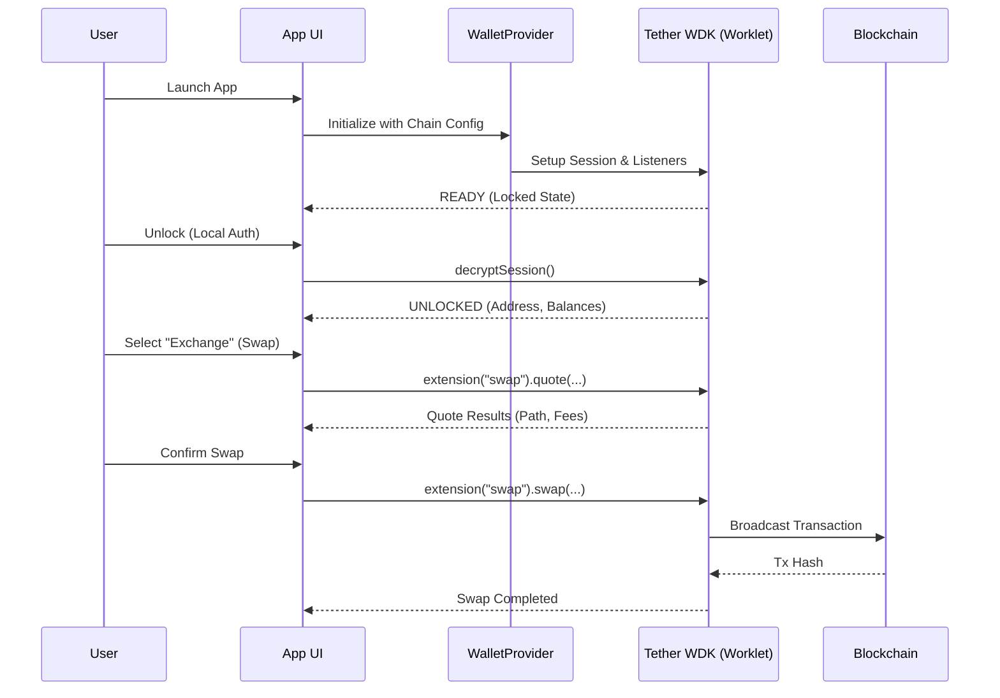

# Tether WDK - Premium Wallet Experience



## 🌟 Mission & Objective

**Mission:**  
To empower users with financial sovereignty by providing a secure, elegant, and frictionless interface for interacting with the Tether ecosystem and decentralized finance. We aim to bridge the gap between traditional banking experiences and the future of programmable money.

**Objective:**  
This project demonstrates a production-grade integration of the **Tether Wallet Development Kit (WDK)**. Our goal is to provide a "Tether-First" experience where every critical action—from balance management to asset exchanges—happens strictly within the application, maintaining high trust and a premium "Apple Wallet" inspired user experience.

---

## 🛠 How It Works

This application is built on **Expo SDK 55** and **React Native 0.83**, leveraging the latest features of the Tether WDK.

### 1. The WDK Core
The app utilizes `@tetherto/wdk-react-native-core` to manage the wallet lifecycle. 
- **Security:** Keys are managed via secure worklets, ensuring that sensitive data is isolated from the main UI thread.
- **Provider Pattern:** A custom `WalletProvider` adapter wraps the native `WdkAppProvider`, allowing for centralized configuration of networks like Ethereum, Arbitrum, and Polygon.

### 2. Apple Wallet UI
The interface follows a "Mobile-First" design philosophy. Assets and networks are presented as a stack of interactive cards. Each card represents a specific chain configuration defined in `src/config/wdk.js`, providing the user with immediate visual context of their holdings.

### 3. In-App Exchange (Strictly Native)
Unlike traditional wallets that redirect to external browsers (Dapps), this project implements **In-App Swaps** using WDK Protocol Extensions. By calling `account.extension('swap')`, the app can:
- Fetch real-time quotes.
- Perform path-finding across liquidity providers.
- Execute the transaction directly through the WDK session.

---

## 📊 Technical Flow

The following sequence diagram illustrates the lifecycle of a user session from initialization to executing an in-app swap:



---

## 🚀 Getting Started

### Prerequisites
- Node.js & npm
- Expo Go or Development Build
- `@tetherto/wdk-worklet-bundler` (for generating native logic)

### Installation
1. Install dependencies:
   ```bash
   npm install
   ```
2. Build the WDK Worklet:
   ```bash
   npm run build:wdk
   ```
3. Start the application:
   ```bash
   npm run android  # or npm run ios
   ```

---

## 📂 Project Structure

- `src/config/wdk.js`: Centralized network and chain definitions.
- `src/providers/WalletProvider.js`: WDK Compatibility Layer.
- `App.js`: Main UI hub with Card Stack and Swap logic.
- `wdk.config.js`: Bundler configuration for the WDK worklet.

---

*This project is built for the Tether ecosystem, focusing on stability, responsibility, and trust.*
